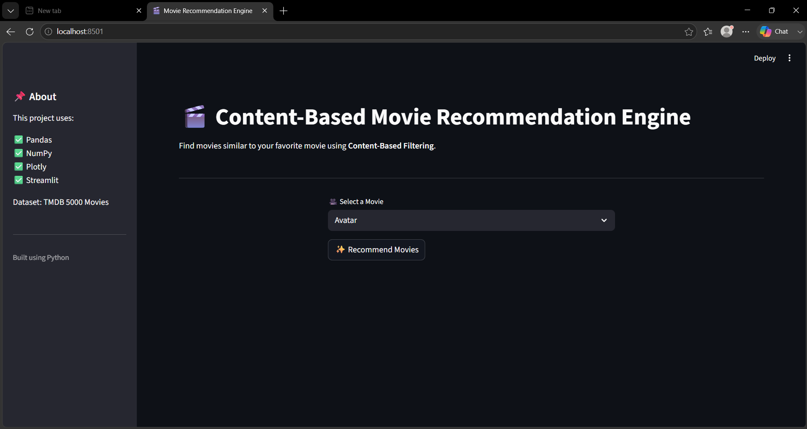
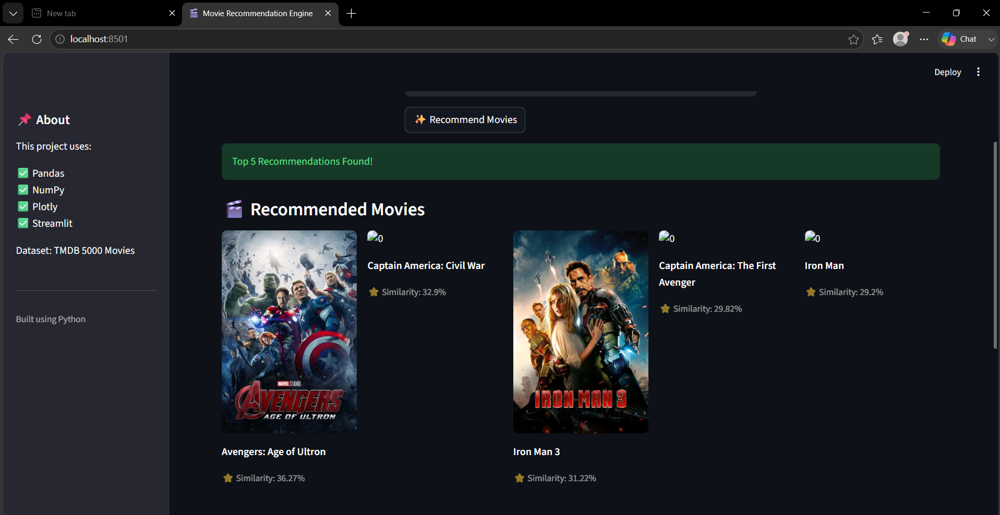
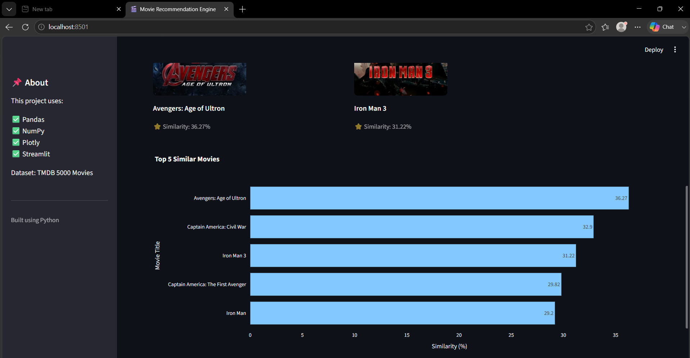

# 🎬 Content-Based Movie Recommendation Engine

A **Content-Based Movie Recommendation System** that recommends similar movies based on movie information like genres, keywords, cast, crew, and overview.

This project uses **text vectorization and cosine similarity** to find movies with similar content. A Streamlit web application is created to provide an interactive user interface.

---

## 🚀 Features

* 🎥 Select your favorite movie
* 🤖 Get top 5 similar movie recommendations
* 🧮 Calculate similarity using Cosine Similarity
* 📊 Visualize recommendation scores using Plotly
* 🖼️ Fetch movie posters using TMDB API
* 🌐 Interactive Streamlit web application

---

## 🛠️ Technologies Used

* **Python**
* **Pandas** - Data loading and preprocessing
* **NumPy** - Vector mathematics and similarity calculation
* **Scikit-learn** - CountVectorizer for text conversion
* **Plotly** - Interactive visualization
* **Streamlit** - Web application interface
* **TMDB API** - Movie poster fetching

---

## 📂 Dataset

Dataset used:

**TMDB 5000 Movie Dataset**

The dataset contains:

* Movie titles
* Genres
* Keywords
* Cast
* Crew
* Movie overview
* Movie IDs

---

## ⚙️ How It Works

### 1. Data Preprocessing

* Movies and credits datasets are merged.
* Important information is extracted.
* A combined `tags` column is created containing movie features.

### 2. Text Vectorization

Movie tags are converted into numerical vectors using:

```
CountVectorizer
```

### 3. Similarity Calculation

Cosine similarity is calculated between movie vectors:

```
Similarity = (A · B) / (||A|| ||B||)
```

Movies with the highest similarity scores are recommended.

### 4. Streamlit Application

The user selects a movie, and the application displays:

* Similar movies
* Similarity percentage
* Movie posters
* Similarity comparison chart

---

Content-Based-Movie-Recommendation
│
├── app.py                         
├── preprocess.py                  
├── recommendation.py              
│
├── dataset
│   ├── tmdb_5000_movies.csv       
│   └── tmdb_5000_credits.csv      
│
├── processed_movies.csv           
├── requirements.txt               
├── .gitignore                     
│
└── screenshots
    ├── home.png                   
    ├── recommendations.png        
    └── chart.png                  

---

## ▶️ Installation & Running

Clone the repository:

```bash
git clone https://github.com/sambartika07/Content-Based-Movie-Recommendation.git
```

Go inside the project folder:

```bash
cd Content-Based-Movie-Recommendation
```

Install required libraries:

```bash
pip install -r requirements.txt
```

Run the Streamlit application:

```bash
streamlit run app.py
```

---

## 📸 Application Preview

### Home Page


### Recommendations


### Similarity Chart


## 🎯 Learning Outcomes

Through this project, I learned:

* Data preprocessing using Pandas
* Working with movie metadata
* Vector representation of text data
* Cosine similarity mathematics
* Building interactive ML applications using Streamlit
* Using APIs in Python projects

---

## 👩‍💻 Author

**Sambartika Jayasingh**

GitHub:
https://github.com/sambartika07
